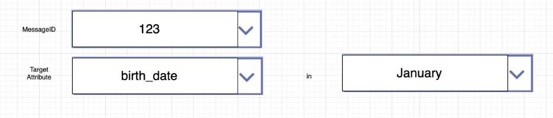
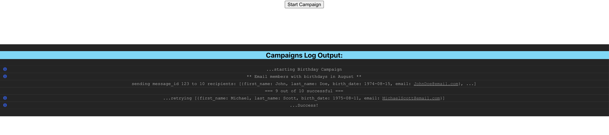

# Campaigns React Webapp

 >npm install && npm start
 >
 >Runs the app in the development mode.
 >
 >Open http://localhost:3000 to view it in the browser.
>
> Feel free to add any packages you may need to complete this assessment

##

Build out this React App that  †`“ sends  ”`  emails to members from the given `members.json` file (found in src/data). 
Which members the app should send to are determined by configurations set by the user in what we call a Campaign.

> † ”sends” is in quotation marks here because we don’t want you to actually send any email. Instead, simply use the given AWS Lambda Function Endpoint provided below under "Sending Messages"
>
>> You can learn more about AWS Lambda Functions here: https://aws.amazon.com/lambda/

A Campaign contains criteria for a member attribute that we want to filter for, a conditional for that attribute, and the message that we want to send. 
For all the members in our `members.json` file that meet the conditional for their attribute, we want to send the specified message. 

For example, consider a Campaign configuration built around the `birth_date` attribute for a member. 
A crude wireframe for the UI could look something like this:



- The dropdown for MessageID should show us all of the possible messages we could send from the `messages.json` file (found in src/data)
- The dropdown for the target attribute should show us the possible attributes available for members and tells us what kind of Campaign that we building, `(birth_date, zip_code, join_date are few but we can also build some around attributes like org_id or last_name)`
- The dropdown options for the conditional should be responsive for the chosen attribute. 
This means if a user chooses `birth_date` as a member attribute to target, let's give them the option "in" and a dropdown with months like in the picture above. So, if we took that wireframe above as our given inputs, it would be a configuration for "send message id 123 to members with birth dates in January"


## Requirements:
Build the Campaign app to allow configurations for the following three attributes:
- Join Date
- Zip Codes
- Birthdays

>If a user chooses `join_date`, let's give them the option "before" and a textbox (or a calendar picker) for them to enter a date. So, it could read something like "send message id 123 to members with join date before March 1st." 

>If a user chooses `zip_code`, let's give them the option "in", and a dropdown for all the available zip codes in `members.json`. So, it could read something like "send message id 123 to members with zip codes in 90001" 

>For `birth_date`, see the above at the wireframe example!

>If you study the `members.json` file, you'll notice that there are other attributes that campaigns could potentially be built around; So bonus points if you bake more options in and get creative with it! 

For each configuration set, find the members that match the criteria and send that group the selected message (see "Sending Messages"")

#### Sending Messages

This React App includes a `Start Campaign Button` and `Campaigns Log Output`
- The Start Campaign Button should start the campaign and "send" messages to the members 
- The Campaigns Log Output should log the events that are happening and provide a stacktrace. Simply using `console.log()` or `console.info()` will write to this log output so you can log throughout the React components you build and it will automatically show up here 

Right now, when a user clicks `Start Campaign`, it will simply output "...starting Campaign" to the Campaigns Log Output section.

After you build out the campaigns section, it should instead send a `POST` request the following Lambda Endpoint and log events: 

>https://qa8lmqoir2.execute-api.us-east-1.amazonaws.com/dev/members/send

The body passed to the Lambda Endpoint should be an object with emails (an array of people you are sending to) and a message_id. A curl request to that endpoint would look like this:
```
curl --location --request POST 'https://qa8lmqoir2.execute-api.us-east-1.amazonaws.com/dev/members/send' \
   --header 'Content-Type: text/plain' \
   --data-raw '{
   	"emails": [
           "me@email.com", 
           "you@email.com", 
           "another@email.com", 
           "us@email.com", 
           "them@email.com"
       ],
   	"message_id": 123
   }'
```

The response will provide a list of successful and failed to send emails. Please implement retry logic in the case of failed-to-send-to emails.

##
After sending, please add logs to the Campaigns Log Output to provide us with a trace of who was being sent an email and any retry logic you might attempt. 
See below for an example of what a Campaign output could look like:



Feel free to style the logs however you'd like and with how much detail you think is necessary. This is where we'll be looking for your filter logic's correctness and to see if our criteria has been met.

## Submission:
- Please host the repo for the app (Github, Bitbucket, etc.) and send a link to it to `adrian@noterouter.com`  with your name and contact information
- Make sure to include a README file with instruction on how to run it, including any dependencies you might have. You can also add pseudo-code, technical notes, or design explanations here.

 


